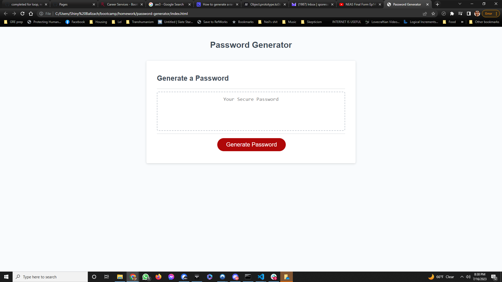

# Module 3 Password Generator

## Description

Provide a short description explaining the what, why, and how of your project. Use the following questions as a guide:

The motivation for this project was to learn effectively how to use prompts, alerts, and confirms in javascript and to apply the aspects of javascript currently being learned. I was motivated by the potential for learning and effective infosec. I built this project to effectively learn how to apply my javascript training. It solves the issue of creating secure passwords. I learned quite a bit in this project: effective logic in my work, the difference in usage between prompts, confirms, and alerts, effective use of math functions, and so much more

## Installation

n/a, runs in browser

## Usage

Click the generate button on the splash page, follow the prompts, selecting at least one set of characters and making sure your password is 8-128 characters in length. Password will be sent to the splash page after completion.

## Credits

- AskBCS
- Jose Lopez: tutoring helped me organize my logic effectively
- Mozilla Developer Network
- https://w3schools.com

## License

MIT Open Software License

---
